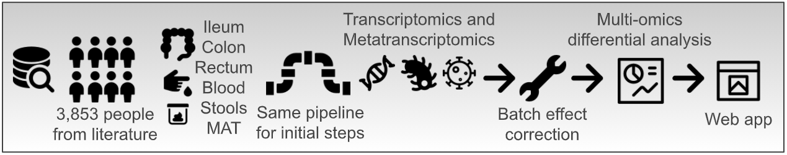
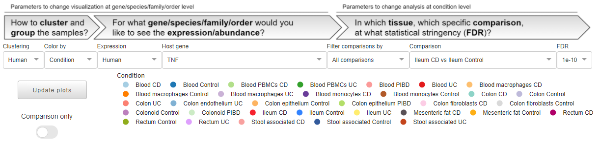

.. TaMMA documentation master file, created by
   sphinx-quickstart on Fri Apr 23 15:27:36 2021.
   You can adapt this file completely to your liking, but it should at least
   contain the root `toctree` directive.

.. image:: ../images/logo.png
  :alt: IBD TaMMA logo

.. toctree::
   :maxdepth: 2
   :caption: Contents:

Welcome to IBD TaMMA's documentation
======================================

`Inflammatory bowel disease (IBD) <https://www.omim.org/entry/266600>`_, including Ulcerative Colitis (UC) and Crohn’s Disease (CD), is a multifaceted chronic inflammatory gut disorder where uncontrolled, resolution-failing inflammation and intestinal dysbiosis are the main traits. To boost the better comprehension of the disease, a high number of computational biology studies has been finalized so far producing numerous RNA sequencing (RNA-Seq) data. Nevertheless, no comparison among the studies has been possible because of the experimental variability and different data analysis approaches. Therefore, to exploit these efforts made over the years in the field of Next Generation Sequencing, we here introduce the IBD Transcriptome and Metatranscriptome Meta-Analysis (IBD TaMMA) platform, a comprehensive survey of 3,853 publicly available RNA-Seq datasets from 26 independent studies performed on IBD-derived and control samples across different tissues, all analyzed with the same computational pipeline and batch corrected for data harmonization and simultaneous comparison.

Quick start
======================================

TaMMA is designed to be as simple, interactive and user-friendly as possible. The web app is divided into 3 different sections: 

- the top one, composed of dropdowns and by a unique legend, can be seen as the **input** section where all the general parameters are read to populate plots and tables.

- the middle one, where all the most important plots are shown.

.. image:: ../images/quickstart2.png
  :alt: quickstart_mid
  :width: 50%
  :align: center
  :target: ../../../images/quickstart2.png

- the bottom one, with different tabs harboring different secondary elements like tables, info, and other plots.

.. image:: ../images/quickstart3.png
  :alt: quickstart_bottom
  :width: 50%
  :align: center
  :target: ../../../images/quickstart3.png

Around the website, there are also some plot-/table-specific input elements (dropdowns, buttons, switches etc.) that are referred only to the plot/table near this element. In addition, each component of TaMMA has a |info| icon that will show you a tooltip explaining the element by hovering the mouse on it.

Since TaMMA is completely interactive, any change in the input section will result in the updating of the plots all over the page in accordance with the new parameters. Some changes will trigger the update automatically (e.g., changing the value of a dropdown), others will require the user explicit command by clicking on an **Update plot** button.

All the plots are produced using the `Plotly graphing libraries <https://plotly.com/graphing-libraries/>`_, which create interactive plots, where you can freely explore each graph with a series of different operations like zooming, clicking, hovering on elements, etc.
Each plot has on the top a toolbar that appear when your mouse pointer is above the graph and that allow you to get more advanced options. For example, it is possible to automatically download the plot by clicking on the camera button in this toolbar.
Finally, the lengend positioned under the dropdowns is also interactive. You can select/unselect features of interest by simply clicking on them. By double-clicking an element you can isolate a specific feature, or select all of them if some are unselected.

A more detailed explanation of all sections and elements is listed in this documentation.

The plots
======================================

Multidimensional scaling visualization with UMAP
-------------------------------------------------

Multidimensional scaling by Uniform Manifold Approximation and Projection (UMAP) consists of the low-dimensional (UMAP1 and UMAP2) embedding of high-dimensional data (e.g., 55k genes in the human transcriptome) and is, therefore, a powerful visualization to get similarities and differences between the samples.

In TaMMA, you can find the same UMAP decorated in two different ways, where dots represent the different samples. On the left dots are colored by a specific user-selected metadata (see :ref:`color_by_dropdown`), while on the right dots are colored by expresion/abundance levels (see :ref:`expression_dropdown`).
These two plots can be used to search for specific clusters of samples that share particular metadata (on the left), or expression/abundance level (on the right) at a sample level. Samples can be filtered according to the **Color by** metadata by selecting the desired features in the legend above, and then by clicking on the **Update plot** button.
It is always possible to zoom in by clicking and dragging an area on the plot. To reset the zoom you can either double click on an empty space in the graph or click on the **Autoscale** button in the toolbar on the top of the plot. 
In the title, it is possible to see how many samples are displayed (n=xxxx), the multidimensional scaling used and the metadata/gene/order/family/species used for coloring the dots. 

Since the metadata UMAP, by default, will not show its legend (it is controlled by the general legend above), there is a switch that allows you to show the legend also on the bottom of the umap for plotting purposes. This legend will only show the selected elements in the main legend and is not interactive. 

.. _boxplots:

Single feature expression/abundance visualization with Box plots
-----------------------------------------------------------------

Box plots are useful to compare, among different groups, the expression/abundance level of what is selected in the **Host gene**/**Order**/**Family**/**Species** dropdown (see :ref:`gene_species_dropdown`). By default, all the elements in the legend are shown although it is possible to show only the desired groups through the legend.
When the **Comparison only** switch is on, only the two conditions of the selected comparison will be shown (see :ref:`contrast_dropdown`).

.. note::

    While the selected metadata dropdown value (see :ref:`color_by_dropdown`) is **Condition**, it is possible to group the box plots by the tissue using the appropriate switch located above the plot. If the selected metadata is not **Condition**, it will not be possible to use this feature.

.. _ma_plot:

Differential expression/abundance visualization with MA plot
-------------------------------------------------------------

MA plots are very useful for the visual representation of differential analyses of omics-derived data. They show sample dispersion in accordance with the log2 fold change between the two conditions of interest (M) and the average expression (A).

This plot shows either the differential gene expression (in case the Expression dropdown is set to **Human**, see :ref:`expression_dropdown`) or the differential order/family/species abundance (in case the Expression dropdown is set to any non-human value).

In the case of a human expression dataset, it is possible to explore the differential gene expression results for a specific comparison. Given a specific stringency (see :ref:`stringecy_dropdown`), up- and down-regulated genes are colored in red or blue, respectively. On the right by clicking on the button **Show gene statistics** it is possible to highlight the selected gene and display its related data and statistics.
In any other case, orders, families, or species are plotted instead of human genes.

If you are interested in a particular dot within the plot, it is possible to click on it to automatically select it within the Host gene/Order/Family/Species dropdown (see :ref:`gene_species_dropdown`), updating all the related plots accordingly.

.. _go_plot:

Gene ontology functional enrichment visualization with GO plot 
----------------------------------------------------------------

Functional enrichment analysis uses statistical approaches to highlight under- or over-represented groups of genes or proteins that belong to specific biological processes.

Through this plot is possible to explore the gene ontology functional enrichment results, related to human differential gene expression, for the selected comparison (see :ref:`contrast_dropdown`). By default, the top 15 significant up (red dots) and down (blue dots) GO categories are shown, ordered by enrichment (dot dimension), for the selected comparison. Statistical significance is represented by color intensity. It is possible to search for specific keywords to filter the results by using the search bar located on top of the plot.

.. note::

    This filtering will also filter the GO table in the same way (see :ref:`go_table`).

The dropdowns
======================================

All the dropdowns are linked to different plots and other dropdowns. In other words, whenever the value of a dropdown changes, some specific elements in the web app will update accordingly. 

Clustering
------------------

This dropdown represents the transcriptome or metatranscriptome multidimensional scaling used for the two UMAP. By changing this value, it is possible to see how the different samples are clustered according to the whole human transcriptome, virome, bacteriome, archaeome, or eukaryome. Changing the value in this dropdown will only update the two UMAPs, changing the position of the samples on the 2D space of the plot.

.. _color_by_dropdown:

Color by
------------------

This dropdown will change the metadata that will be used to color the legend controlling the colors of the dots in the metadata UMAP and the boxplots. The metadata that we have collected for TaMMA are both discrete and continuous. Continuous variables, like patient age, will color the dots in the UMAPs but will not plot any boxplot.
The default value for this dropdown is **Condition** that is the union of **Tissue** and **Group** metadata and these are used in the overall analysis to perform the differential gene expression analysis.

.. _expression_dropdown:

Expression
------------------

By changing this dropdown, you can select which expression/abundance matrix you want to use for plotting the expression UMAP and the box plots. By selecting **Human**, only the expression levels for human genes are used, while by selecting the other options you can see the abundance levels of the different metatranscriptome components (Archaea, Bacteria, Eukaryota, Viruses) by three classification levels (orders, families, and species).

.. _gene_species_dropdown:

Host gene/Order/Family/Species
-------------------------------------

This dropdown can contain different elements, depending on the expression dropdown value:

- Human: will contain 55,478 unique human genes (`GENCODE v35 gene annotations <https://www.gencodegenes.org/>`_).
- Archaea by... : will contain only archaeal orders/families/species, depending on the selected classification level 
- Bacteria by... : will contain only bacterial orders/families/species
- Eukaryota by... : will contain only eukaryotic orders/families/species
- Viruses by... : will contain only viral orders/families/species

.. note::

    The selected element will be used to color the samples in the expression UMAP, for the boxplots, and will be highlighted in the MA plot. 

Tissue
------------------

This dropdown is used to filter the following dropdown (Comparison) by a given tissue.

.. _contrast_dropdown:

Comparison
------------------

This dropdown selects the comparison used for the differential gene expression results and the resulting gene ontology enrichment analysis. Thus, changing this dropdown will update both MA and GO plots, and their relative tables. The comparison follows the scheme of **Tissue Group A vs Tissue Group B**. As mentioned before, the comparisons can be filtered by **Tissue**. 

.. note::

    On the left of the legend, there is a **Comparison only** switch which automatically selects the two conditions in the **Comparison** dropdown (Condition1 vs Condition2). If you activate this switch while the selected metadata is not **Condition**, the dropdown value will be changed too.
    While the switch is active, changing the **Comparison** dropdown will also change the selected legend items accordingly, expediting the focus on the specific contrast by filtering simultaneously metadata UMAP and box plots.
    If you select another condition in the legend while the switch is on and then you update the plots, the switch will be turned off. If you manually turn it off, all the conditions will be automatically selected again.

.. _stringecy_dropdown:

FDR
------------------

This parameter is used to control the stringency of the differential gene expression analysis and will affect the number of significant differentially expressed genes (colored dots) in the MA plot and the DGE table (colored rows).

The tabs
======================================

In the bottom part of the web app, there are several tabs with other secondary content, spacing from plots, links, images to exportable tables. 

Summary
------------------

In this tab, a schematic representation of the analysis workflow is shown.
The sankey plot is used to display the relationships between the samples and their metadata. By hovering the mouse on a specific location it is possible to see the number of samples having that feature, for example the *CD* metadata and the *Ileum* metadata are present in 1,380 samples.

Metadata
------------------

In this tab, there is the full metadata table used to populate the :ref:`color_by_dropdown` plus other info like, for example, the GSE link to the specific study on `NCBI GEO <https://www.ncbi.nlm.nih.gov/geo/>`_. The table has native sorting and filtering (by exact match) interactivity options.

.. _multiboxplots_tab:

Box plots
------------------

In this tab, you can easily plot many series of box plots of different features depending on the :ref:`expression_dropdown` (human genes if **Human** is selected, or orders/families/species if another value is selected). For performance and usability reasons, it is possible to plot up to 10 elements at a time.
To select the elements to plot, you have two different options:

- search and manually select within the dropdown one element at time
- search many elements in one click by using the text area below the dropdown

The search area is flexible. It is case-insensitive and you can provide genes separated by whitespaces, commas, or semicolons. For other elements, it is still case-insensitive but you need to put one item per line. If one or more elements are not found, a message will appear below it indicating missing matches. In these cases, we invite you to check for spelling errors, typos, or to directly search in the dropdown. 

.. note::

    Like for :ref:`boxplots`, while the selected metadata dropdown value (see :ref:`color_by_dropdown`) is **Condition**, it is possible to group, the box plots by condition using the appropriate switch that is located below the search button. If the selected metadata is not **Condition**, it will not be possible to use this feature.

.. _dge_table: 

DGE table
------------------

In this tab, you can explore the differential gene expression or order/family/species abundance (depending on the :ref:`expression_dropdown` dropdown) results. Statistically significant features (see :ref:`stringecy_dropdown` for stringency details) are highlighted by colored rows; red for upregulated genes or overepresented orders/families/species, blue for downregulated genes or underrepresented orders/families/species in respect to the selected comparison (see :ref:`contrast_dropdown`). The table natively supports the sorting of columns values.

For each row in the table, there is a number of links to external resources:

- `NCBI Gene <https://www.ncbi.nlm.nih.gov/gene/>`_ or `NCBI Genome <https://www.ncbi.nlm.nih.gov/genome/>`_ depending on the expression dropdown
- `Ensembl <https://www.ensembl.org/index.html>`_ (only for **Human** expression dropdown)
- `GeneCards <https://www.genecards.org/>`_ (only for **Human** expression dropdown)
- `IBD exome browser <https://ibd.broadinstitute.org/>`_ (only for **Human** expression dropdown)
- `GWAS Catalog <https://www.ebi.ac.uk/gwas/>`_ (only for **Human** expression dropdown which have both *Gene* and *Gene ID*)
- `GTEx portal <https://www.gtexportal.org/home/>`_ (only for **Human** expression dropdown which have both *Gene* and *Gene ID*)

Since the table will have many entries (for Human transcriptome there will be more than 55,000 rows), you can filter this table by selecting mutiple elements in the dropdown, creating an additional table on top of the full table. 

It is possible to easily download both the full and filtered tables by clicking on the respective download buttons.

.. note::

    Similar to :ref:`ma_plot`, clicking on a Gene/Order/Family/Species cell will change the selected element in the right dropdown (see :ref:`gene_species_dropdown`), thus updating all the relevant plots. 

.. _go_table:

GO table
------------------

Here, the gene ontology functional enrichement analysis results are shown, for the selected comparison (see :ref:`contrast_dropdown`), with an FDR < 1e-10. As for genes in the :ref:`dge_table`, statistically significant GO categories are highlighted by colored rows, with red and blue rows representing up- or down-regulated biological processes, respectively. The table natively support sorting of columns values. Each GO ID is a link to the respective GO category within the `AmiGO <http://amigo.geneontology.org/amigo>`_ website.

As explained in the :ref:`go_table`, this table can be filtered using the GO plot keyword search bar: the GO categories plotted will be those displayed in the table. You can easily download both the full or the filtered table using the download buttons.

Literature
------------------

Here, we collected a series of previous scientific evidence that is validated in TaMMA. The plots here are not related to any of the dropdowns on the top of the website and are not interactive.
